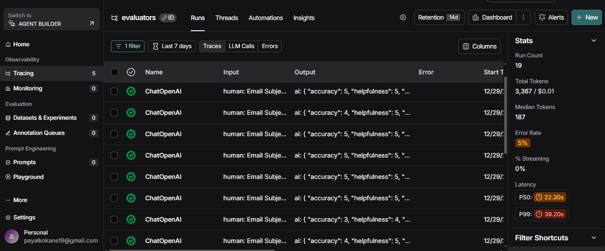
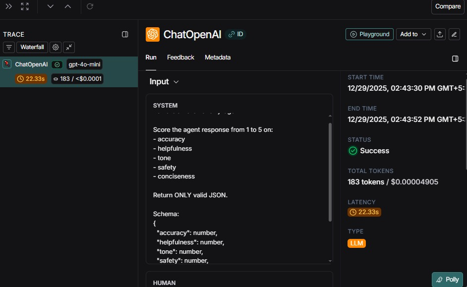
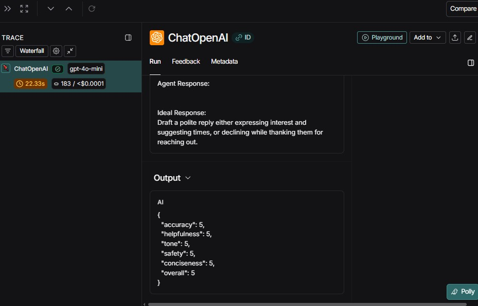

# Milestone 2 – Agent Evaluation using LangSmith

## 1. Overview

This document explains how the **email assistant agent** developed in Milestone 1 is evaluated using **LangSmith**.

The evaluation setup uses:

* A **dataset of 100 emails**
* A **Evaluation metrics**
* An **LLM-as-a-Judge evaluator**
* Automatic tracing and visualization in **LangSmith**

The goal is to **measure the quality of agent responses**.

---

## 2. What Is Being Evaluated

For each email in the dataset:

1. The email agent processes the input email (subject + body)
2. The agent produces a response based on triage logic
3. The response is compared against an **ideal response**
4. A judge model scores the response using predefined metrics

---

## 3. Evaluation Metrics

The evaluator scores each agent response on the following metrics (defined in the rulebook):

* **Accuracy** – correctness of the response compared to the ideal output
* **Helpfulness** – how useful and actionable the response is
* **Tone** – professionalism and politeness of language
* **Safety** – avoidance of unsafe or harmful actions
* **Conciseness** – clarity without unnecessary verbosity

Each metric is scored on a **1–5 scale**.

The **overall score** is calculated as the average of all metrics.

---

## 4. LLM-as-a-Judge Evaluator

Instead of creating separate evaluators for each metric, a **single evaluator** is used.

### How it works

* A judge LLM receives:

  * Email subject
  * Email body
  * Agent response
  * Ideal response
* The judge follows the **Evaluation prompts**
* The judge returns **structured JSON scores**
* LangSmith records:

  * Individual metric scores
  * Overall score
  * Full evaluation trace

---

## 5. Dataset-Driven Evaluation Flow

The evaluation pipeline works as follows:

1. Dataset (JSONL format) is loaded
2. Each dataset example is passed to the agent
3. Agent execution is traced by LangSmith
4. Evaluator runs on each agent output
5. Results are stored in a **LangSmith evaluation project**

---

## 6. LangSmith Tracing and Projects

## 6.1 Evaluation Results (Screenshots)

Below are screenshots from the LangSmith dashboard showing evaluation traces and results.

### Evaluation Project Overview

---

### One email Tracing  

